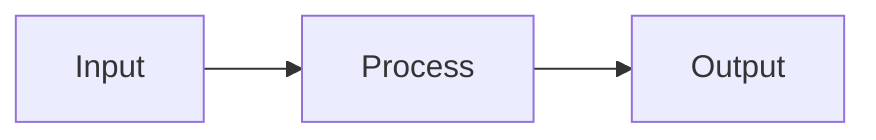

<p align="center">
  
</p>

<h1 align="center">MarkStack</h1>

<p align="center">
  <strong>A lightweight static site generator for markdown-based knowledge bases and documentation.</strong>
</p>

<p align="center">
  Transform your markdown files into a searchable, professional documentation website with minimal resource overhead.
</p>

<p align="center">
  <a href="#features">Features</a> |
  <a href="#use-cases">Use Cases</a> |
  <a href="#quick-start">Quick Start</a> |
  <a href="#documentation">Documentation</a> |
  <a href="#deployment">Deployment</a> |
  <a href="#license">License</a>
</p>

<p align="center">
  
  
  
  
</p>

---

## Design Philosophy

MarkStack is built on a simple premise: **Documentation should be accessible, robust, and permanent.** It is designed to serve all walks of life, from the student building a second brain, to the Dungeon Master organizing a campaign, to the Enterprise Architect enforcing ISO compliance.

**Built for the "Potato" & the Cloud**
I intentionally developed MarkStack on a single-core, 1GB RAM virtual machine. Why? Because if it runs there, it runs *anywhere*.
* **For the Hobbyist:** Run it on a Raspberry Pi Zero 2 W, an old laptop, or a free cloud tier. It respects your hardware.
* **For the Enterprise:** It scales effortlessly in high-availability clusters with zero resource bloat.

**Radical Simplicity: Vanilla by Design**
Modern web development has become over-complicated. MarkStack rejects this. We use **Vanilla JavaScript** and a single file build process. There is no complex architecture to learn, no "magic" black-box frameworks, and no fragility.
* **Hackable:** Because the code is simple and transparent, you can read it, understand it, and modify it to fit your exact needs.
* **Future-Proof:** With no heavy dependencies, your documentation site won't break just because an npm package updated 5 years from now.

**Enterprise Grade: Compliance & Audit**
In professional environments, documentation is a legal record. MarkStack solves "documentation rot" by treating your docs *as code*.
* **The Audit Trail:** You get an immutable Git history for every comma changed. Strict Pull Request workflows mean nothing goes live without approval. This is perfect for ISO record-keeping.
* **Accountability:** No more "mystery edits." You know exactly who wrote that API guide, who approved it, and when it went live.

**The "Headless" Brain: From D&D to Ph.D.**
You don't need to be a systems engineer to have a powerful, globally accessible knowledge base. MarkStack turns GitHub (or any private Git repo) into your personal Content Management System.
* **The Workflow:** Creating a study guide for a new subject? Managing lore for your D&D campaign? Just edit your files in the browser on GitHub (even on mobile!) and your site updates automatically if you setup the workflow, or if you have a site you use Cloudflare Pages or GitHub Pages with, it updated with each update to the repo!
* **The Freedom:** You get the ease of a note-taking app with the power of a static site. Your data remains yours. It is private, portable, and secure, stored in simple Markdown files that you will always own.

**OFF LINE MODE!**
* **Take it with you:** You can just clone the repo, build your first few pages and copy it to a USB, take it with you and use any text editor on any computer to edit the .md files! I REALLY recommend Caddy, it has a portable version for every OS, be it MacOS or Linux or Windows so basically all you have to do is just copy the the executable / binary to the dist folder and run it after you ran the script to build your files.
You can find it here: [Caddy Offical Repo](https://github.com/caddyserver/caddy/releases)

---

## Use Cases

MarkStack adapts to a wide range of documentation needs. The table below outlines common scenarios where teams and individuals have successfully deployed MarkStack-powered sites.

| Use Case | Description | Example |
|----------|-------------|---------|
| **Product Documentation** | Public-facing documentation for software products, APIs, or services. Supports versioning through Git branches and provides professional presentation for end users. | SaaS product help center, open source project documentation |
| **Internal Knowledge Base** | Centralized repository for company policies, procedures, and institutional knowledge. Searchable and accessible to all team members without external dependencies. | IT runbooks, HR policies, operational procedures |
| **Developer Handbook** | Onboarding resource for new developers joining a team. Documents codebase architecture, development workflows, coding standards, and deployment processes. | Engineering team onboarding, contributor guidelines |
| **API Reference** | Technical reference documentation with code examples, endpoint descriptions, and authentication guides. Syntax highlighting supports 190+ languages. | REST API documentation, SDK reference |
| **Personal Knowledge Base** | Private or public collection of notes, tutorials, and reference material. Ideal for developers maintaining their own technical notes. | Learning notes, technology comparisons, how-to guides |
| **Course Material** | Educational content with structured navigation, code examples, and progressive learning paths. Task lists enable progress tracking for students. | Programming tutorials, certification study guides |
| **Project Wiki** | Lightweight alternative to traditional wiki software. Version-controlled through Git with full change history and collaborative editing through pull requests. | Team project documentation, research notes |

---

## GitHub-Native Workflow

MarkStack uses standard GitHub-flavored Markdown for all content. This design decision enables a streamlined documentation workflow that integrates directly with your existing development process.

**How it works:**

1. Documentation lives alongside your code in the same repository
2. Edit any `.md` file directly in the GitHub web interface or your local editor
3. Commit and push changes through your normal Git workflow
4. Rebuild the site with a single command
5. All changes are tracked in Git history with full attribution

This approach eliminates the need for separate documentation platforms or content management systems. Your documentation benefits from the same review process, branching strategy, and collaboration tools you already use for code. Pull requests enable documentation reviews, and merge conflicts are resolved using familiar Git workflows.

```bash
# Update documentation from the latest changes
git pull origin main
npm run build

# Documentation is now current
```

---

## Features

### Content Authoring

- **Standard Markdown** with YAML frontmatter, compatible with GitHub rendering
- **GitHub-style alerts** for NOTE, TIP, IMPORTANT, WARNING, and CAUTION callouts
- **Task lists and footnotes** for checklists and academic-style references
- **Syntax highlighting** for 190+ programming languages via highlight.js
- **Mermaid diagrams** for flowcharts, sequence diagrams, and other visualizations

### User Experience

- **Dark and light themes** with automatic preference persistence
- **IBM Plex typography** for professional, readable text
- **Responsive layout** that adapts to desktop, tablet, and mobile screens
- **Collapsible sidebar** with hierarchical navigation

### Performance

- **Fast builds** averaging 1.0 to 1.4 seconds for sites with 50+ content-heavy pages
- **Single-file architecture** with no build toolchain complexity
- **Zero client-side frameworks** using only vanilla JavaScript
- **Static HTML output** requiring no application server

### Search

- **Full-text client-side search** that works offline
- **Fuzzy matching** to find results even with partial or misspelled queries
- **Keyboard navigation** with Ctrl+K shortcut to open search
- **Context highlighting** showing matches within search results

---

## Quick Start

```bash
# Clone the repository
git clone https://github.com/KineticEnforcer/MarkStack.git
cd MarkStack

# Install dependencies
npm ci

# Build the site
npm run build

# Preview locally
npm run serve
```

Open http://localhost:3000 in your browser. Your documentation site is ready for content.

---

## Documentation

MarkStack includes comprehensive documentation covering all aspects of the system:

| Section | Description |
|---------|-------------|
| [Getting Started](content/getting-started/) | Installation requirements, quickstart guide, project structure overview |
| [Authoring Content](content/authoring/) | Markdown features, frontmatter schema, content organization patterns |
| [Configuration](content/configuration/) | Site settings, homepage customization, metadata options |
| [Customization](content/customization/) | Theme variables, CSS customization, template modification |
| [Build and Deploy](content/build-deploy/) | CLI commands, CI/CD integration, hosting platform setup |
| [Architecture](content/architecture/) | Build pipeline internals, navigation generation, search indexing |
| [Troubleshooting](content/troubleshooting/) | Common issues with solutions, frequently asked questions |

---

## Project Structure

```
markstack/
├── build.js              # Build script (single-file static site generator)
├── siteconfig.json       # Site configuration
├── content/              # Markdown content directory
│   ├── _index.md         # Homepage content (optional)
│   └── category/         # Category folders
│       ├── _index.md     # Category landing page
│       └── article.md    # Individual articles
├── templates/
│   └── base.html         # HTML template with placeholders
├── static/               # Static assets copied to output
│   ├── css/              # Stylesheets
│   ├── js/               # Client-side JavaScript
│   └── svg/              # Logo and icons
└── dist/                 # Generated output (excluded from version control)
```

---

## Configuration

Edit `siteconfig.json` to customize your site:

```json
{
  "siteTitle": "My Knowledge Base",
  "headerTitle": "MyKB",
  "siteSubtitle": "Documentation for everything",
  "siteUrl": "https://docs.example.com",
  "baseUrl": "",
  "defaultDescription": "Knowledge base and documentation",
  "showHero": true,
  "copyrightText": "© 2026 Your Name"
}
```

| Property | Description |
|----------|-------------|
| `siteTitle` | Full site title used in browser tabs and metadata |
| `headerTitle` | Shorter title displayed in the site header |
| `siteSubtitle` | Tagline displayed on the homepage hero section |
| `siteUrl` | Base URL for canonical links and Open Graph metadata |
| `baseUrl` | Path prefix for all internal links (see table below) |
| `defaultDescription` | Fallback description for pages without frontmatter |
| `showHero` | Toggle homepage hero section visibility |
| `copyrightText` | Footer copyright notice |

### Base URL Configuration

The `baseUrl` setting controls the path prefix for all internal links. Set it according to where your site is hosted:

| Hosting Location | `baseUrl` Value | Example URL |
|-----------------|-----------------|-------------|
| Root domain | `""` (empty string) | `https://docs.example.com/` |
| Subdirectory | `"/docs"` | `https://example.com/docs/` |
| GitHub Pages (user site) | `""` | `https://username.github.io/` |
| GitHub Pages (project site) | `"/repo-name"` | `https://username.github.io/repo-name/` |

For most deployments, leave `baseUrl` empty. Only set it when hosting in a subdirectory or on a GitHub Pages project site.

---

## Writing Content

### Creating a Page

```bash
# Create a new article
echo "# My Article" > content/my-article.md
npm run build
```

### Creating a Category

```bash
# Create a category with a landing page
mkdir content/tutorials
cat > content/tutorials/_index.md << 'EOF'
---
title: Tutorials
description: Step-by-step guides for common tasks.
---
EOF

# Add an article to the category
echo "# Getting Started" > content/tutorials/getting-started.md
npm run build
```

### Frontmatter

Every page can include YAML frontmatter for metadata:

```yaml
---
title: Page Title
description: Description for search engines and social sharing.
---

Content begins here...
```

### Alerts

Use GitHub-style alert syntax for callouts:

```markdown
> [!NOTE]
> Supplementary information the reader should know.

> [!TIP]
> Helpful advice for better results.

> [!IMPORTANT]
> Critical information for successful outcomes.

> [!WARNING]
> Potential issues the reader should be aware of.

> [!CAUTION]
> Risk of negative consequences from specific actions.
```

### Diagrams

Create diagrams using Mermaid syntax:

~~~markdown

~~~

---

## Commands

| Command | Description |
|---------|-------------|
| `npm run build` | Generate static site to the `dist/` directory |
| `npm run watch` | Rebuild automatically when content files change |
| `npm run serve` | Start a local preview server on port 3000 |
| `npm run clean` | Remove the `dist/` directory |

**Development workflow:**

```bash
# Terminal 1: Watch for changes and rebuild
npm run watch

# Terminal 2: Serve the site locally
npm run serve
```

---

## Deployment

MarkStack generates static HTML files that can be hosted on any web server or static hosting platform.

| Platform | Configuration |
|----------|---------------|
| **Cloudflare Pages** | Connect repository. Build command: `npm run build`. Output directory: `dist` |
| **GitHub Pages** | Push contents of `dist/` to a `gh-pages` branch or configure Actions workflow |
| **Netlify** | Connect repository. Build command: `npm run build`. Publish directory: `dist` |
| **Vercel** | Connect repository. Framework preset: Other. Output directory: `dist` |
| **AWS S3** | Upload contents of `dist/` to an S3 bucket configured for static hosting |
| **Self-hosted** | Copy contents of `dist/` to your web server document root |

For automated deployments, see the [CI/CD Integration](content/build-deploy/ci-cd.md) documentation.

---

## Technology

| Component | Implementation |
|-----------|----------------|
| Markdown Processing | [markdown-it](https://github.com/markdown-it/markdown-it) with anchor, footnote, and task list plugins |
| Frontmatter Parsing | [gray-matter](https://github.com/jonschlinkert/gray-matter) |
| Syntax Highlighting | [highlight.js](https://highlightjs.org/) supporting 190+ languages |
| Diagram Rendering | [Mermaid](https://mermaid.js.org/) for flowcharts and diagrams |
| File Watching | [chokidar](https://github.com/paulmillr/chokidar) for development mode |
| Frontend | Vanilla JavaScript with no framework dependencies |
| Typography | IBM Plex Sans and IBM Plex Mono |

---

## Requirements

- Node.js 18.0.0 or higher
- npm (included with Node.js)

No additional build tools, compilers, or system dependencies are required.

---

## License

This project is licensed under the GPL-3.0 license. See [LICENSE](LICENSE) for the full license text.

---

<p align="center">
  <sub>Built for developers who value simplicity and performance.</sub>
</p>
