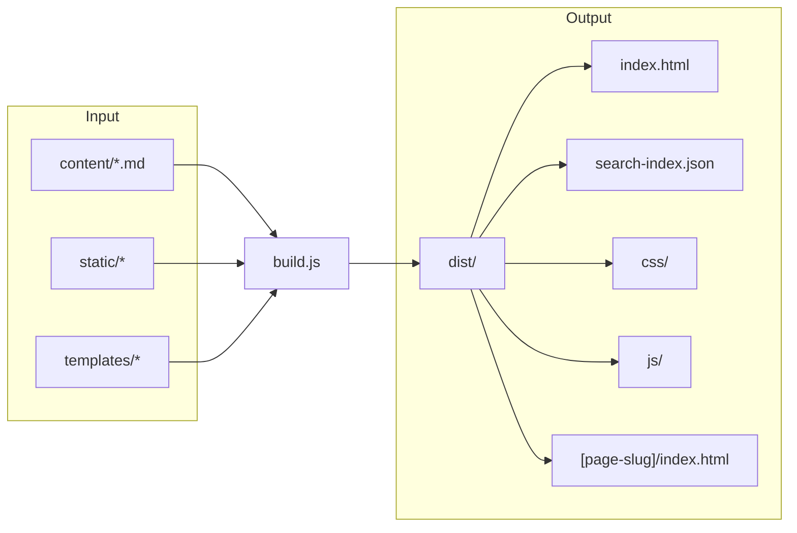

# Architecture

This section explains how MarkStack works under the hood. Understanding the architecture helps you extend the system, debug issues, and make informed decisions about customization.

## Design Philosophy

MarkStack follows several design principles:

- **Single-file build script**: All build logic lives in `build.js` (approximately 800 lines). No framework overhead, no complex module structure.
- **Zero runtime dependencies**: The generated site is pure HTML, CSS, and JavaScript. No server-side processing required.
- **Conventional structure**: Directories map to URLs, filenames map to page titles. No configuration required for basic usage.
- **Progressive enhancement**: The site works without JavaScript, but interactive features (search, theme toggle) require it.

## System Overview

MarkStack consists of three main components:

### 1. Build Script (build.js)

A Node.js script that transforms markdown content into a static website. It runs at build time, not runtime.

### 2. HTML Template (templates/base.html)

A single template file with placeholders that the build script populates for each page.

### 3. Client-Side JavaScript (static/js/app.js)

Handles interactive features in the browser: theme toggle, sidebar navigation, search, code copy buttons.

## High-Level Build Flow

1. Build script reads all markdown files from `content/`
2. Parses frontmatter and converts markdown to HTML
3. Generates navigation structure (sidebar, breadcrumbs)
4. Applies HTML template with placeholders
5. Outputs static files to `dist/`
6. Creates search index for client-side search
7. Copies static assets unchanged

## What This Section Covers

### Build Pipeline

The [Build Pipeline](/architecture/build-pipeline/) page explains:

- How files are discovered and processed
- Markdown rendering with plugins
- Template system and placeholder replacement
- Output file structure

### Navigation and Routing

The [Navigation and Routing](/architecture/navigation-routing/) page covers:

- URL generation from titles
- Sidebar tree construction
- Breadcrumb generation
- Clean URL handling

### Search Indexing

The [Search Indexing](/architecture/search-indexing/) page details:

- Search index generation
- Client-side search algorithm
- Search result ranking
- Index optimization

## File Responsibilities

| File | Responsibility |
|------|----------------|
| `build.js` | Complete static site generation |
| `templates/base.html` | Page structure and placeholders |
| `static/js/app.js` | Interactive browser features |
| `static/css/main.css` | All styling and theming |
| `static/css/hljs-theme.css` | Code syntax highlighting |
| `siteconfig.json` | Site-wide configuration values |

## Dependencies

MarkStack uses minimal dependencies:

| Package | Purpose |
|---------|---------|
| `markdown-it` | Markdown parsing |
| `markdown-it-anchor` | Heading anchor links |
| `markdown-it-footnote` | Footnote syntax |
| `markdown-it-task-lists` | Checkbox task lists |
| `gray-matter` | YAML frontmatter parsing |
| `highlight.js` | Syntax highlighting |
| `chokidar` | File watching (dev mode only) |

No build tools like webpack, rollup, or bundlers. No CSS preprocessors. No framework dependencies.

## Extension Points

When you need to extend MarkStack:

- **New markdown features**: Add markdown-it plugins in `build.js`
- **New template placeholders**: Modify `generatePage()` in `build.js`
- **New client features**: Add code to `static/js/app.js`
- **New styles**: Add CSS to `static/css/main.css`
- **New alert types**: Extend `alertIcons` object in `build.js`

## Performance Characteristics

MarkStack builds are fast because:

- All processing happens in memory
- No external API calls during build
- No complex AST transformations
- Simple string-based template system
- Direct file I/O without caching layers

Typical build times:

- 10 pages: ~50ms
- 50 pages: ~100ms
- 200 pages: ~300ms

## When to Read This Section

Read the architecture documentation if you:

- Want to understand how MarkStack works
- Need to add custom features
- Are debugging build issues
- Plan to contribute to the project
- Want to fork and modify the system

> [!NOTE]
> You do not need to understand the architecture to use MarkStack for documentation. This section is for those who want deeper knowledge or need to extend the system.
