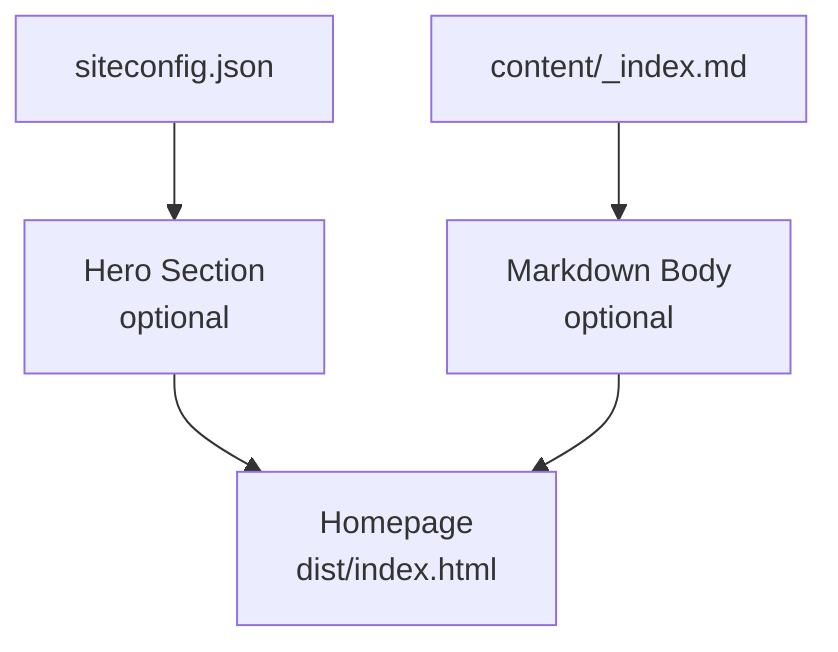

# Homepage Content

The homepage is the first thing visitors see when they arrive at your documentation site. MarkStack gives you flexibility in how you design this experience, combining configuration settings with optional markdown content.

This guide explains how the homepage works and the different approaches you can take to create an effective landing page.

## How the Homepage Works

The homepage is generated from two sources:

1. **siteconfig.json**: Controls the hero section (title, subtitle, visibility)
2. **content/_index.md**: Optional markdown content rendered below the hero

When someone visits the root URL of your site (`/`), MarkStack combines these sources to generate the homepage.

### Homepage Generation Process



## The Hero Section

The hero section is a prominent area at the top of the homepage displaying your site title and subtitle.

### Enabling the Hero

The hero appears when `showHero` is `true` (the default):

```json
{
  "siteTitle": "My Documentation",
  "siteSubtitle": "Complete guides and API reference",
  "showHero": true
}
```

This produces a hero section with:

- A large heading showing `siteTitle`
- A smaller paragraph showing `siteSubtitle`
- Styled background that matches your theme

### Disabling the Hero

Set `showHero` to `false` for a more compact homepage:

```json
{
  "showHero": false
}
```

Without the hero, the homepage displays:

- The site header (same as all pages)
- Content from `content/_index.md` (if present)
- The sidebar navigation

### When to Use Each Approach

| Use Hero | Best For |
|----------|----------|
| Yes | Product documentation, marketing-oriented sites, sites needing strong branding |
| No | Technical references, internal documentation, compact utility-focused sites |

## Adding Custom Homepage Content

Create `content/_index.md` to add markdown content to your homepage. This content appears below the hero (or at the top if the hero is disabled).

### Basic Homepage Content

```markdown
---
description: Welcome to our documentation. Find guides, tutorials, and references.
---

# Welcome

This documentation helps you get started quickly and find answers to your questions.

## Popular Topics

- [Getting Started](/getting-started/) for new users
- [API Reference](/api/) for developers
- [FAQ](/troubleshooting/faq/) for common questions
```

### Homepage with Feature Highlights

```markdown
---
description: Official documentation for ExampleApp with guides, tutorials, and API reference.
---

## Quick Links

| I want to... | Go to... |
|--------------|----------|
| Install the software | [Installation Guide](/getting-started/installation/) |
| Learn the basics | [Quick Start Tutorial](/getting-started/quickstart/) |
| Integrate via API | [API Reference](/api/) |
| Troubleshoot issues | [Common Problems](/troubleshooting/common-issues/) |

## What's New

- **v2.1 Released**: New dashboard features and performance improvements
- **Updated API docs**: All endpoints now include example requests
- **Video tutorials**: Watch our new getting started series

## Need Help?

Check the [FAQ](/troubleshooting/faq/) or [contact support](mailto:support@example.com).
```

### Homepage with Callouts

```markdown
---
description: Learn how to use AwesomeLib with comprehensive documentation and examples.
---

> [!TIP]
> New to AwesomeLib? Start with the [5-minute quickstart](/getting-started/quickstart/).

## Documentation Sections

### For Beginners

The [Getting Started](/getting-started/) section walks you through installation, basic concepts, and your first project.

### For Developers

The [API Reference](/api/) provides complete documentation for every function, class, and configuration option.

### For Operations

The [Deployment Guide](/deployment/) covers production configuration, monitoring, and scaling.

> [!NOTE]
> This documentation covers version 2.x. For version 1.x documentation, visit [v1.example.com](https://v1.example.com).
```

## Homepage Without content/_index.md

If you do not create `content/_index.md`, the homepage shows:

- The hero section (if enabled)
- The sidebar navigation
- No main content area

This works for very simple sites, but most documentation benefits from at least a brief introduction and navigation guidance on the homepage.

## Combining Hero and Content

The most common approach uses both the hero and custom content:

**siteconfig.json:**

```json
{
  "siteTitle": "ExampleApp Documentation",
  "siteSubtitle": "Everything you need to build with ExampleApp",
  "showHero": true
}
```

**content/_index.md:**

```markdown
---
description: Official ExampleApp documentation with tutorials, guides, and API reference.
---

## Getting Started

New to ExampleApp? Follow our step-by-step guide to install the software and build your first project.

[Start the tutorial](/getting-started/) 

## Browse by Topic

- **[Guides](/guides/)** - Task-oriented tutorials
- **[Reference](/reference/)** - API and configuration documentation  
- **[Examples](/examples/)** - Sample code and projects
```

This creates a homepage with:

1. A hero section with the title "ExampleApp Documentation" and subtitle
2. A "Getting Started" section with a link to the tutorial
3. A topic list for easy navigation

## Content-Only Homepage

For a more compact, content-focused homepage:

**siteconfig.json:**

```json
{
  "siteTitle": "Technical Reference",
  "showHero": false
}
```

**content/_index.md:**

```markdown
---
description: Technical reference documentation and specifications.
---

# Technical Reference

This documentation provides specifications, API details, and implementation guidance.

## Sections

| Section | Contents |
|---------|----------|
| [Specifications](/specs/) | Protocol specifications and data formats |
| [API](/api/) | REST API endpoint documentation |
| [SDKs](/sdks/) | Client library documentation |
| [Examples](/examples/) | Code samples and reference implementations |

## Recent Updates

- Specification v3.2 published with new authentication flow
- Python SDK updated to support async operations
- New examples for webhook integration
```

This homepage immediately presents content without the visual prominence of a hero section.

## Homepage Description

The `description` in `content/_index.md` frontmatter provides the meta description for your homepage:

```markdown
---
description: Official documentation for ExampleApp including installation guides, tutorials, and complete API reference.
---
```

This description appears in:

- Search engine results for your homepage
- Social media previews when someone shares your homepage URL
- The HTML `<meta name="description">` tag

Write a compelling description that tells visitors what your documentation covers. Since the homepage often receives the most search traffic, its description is especially important for SEO.

If you omit the `description` in `content/_index.md`, MarkStack uses `defaultDescription` from `siteconfig.json`.

## Layout Considerations

When designing your homepage, consider:

### Above the Fold

The content visible without scrolling should:

- Identify what the documentation covers
- Help visitors navigate to common destinations
- Work for both new and returning visitors

### Information Hierarchy

Structure content from general to specific:

1. Site identification (hero or title)
2. Primary navigation paths
3. What's new or highlighted content
4. Additional resources

### Mobile Responsiveness

The homepage uses the same responsive design as all pages:

- On mobile, the sidebar collapses
- Content stacks vertically
- Tables may scroll horizontally

Keep homepage content scannable and avoid very wide tables.

## Testing Your Homepage

After configuring your homepage:

1. Run `npm run build` to generate the site
2. Run `npm run serve` to start the preview server
3. Open `http://localhost:3000` in your browser
4. Verify the hero appears (or not) as expected
5. Check that custom content renders correctly
6. Test navigation links
7. View the page source to verify meta tags

> [!TIP]
> Test your homepage on both desktop and mobile screen sizes. The sidebar collapses on mobile, so your homepage content becomes the primary navigation.
